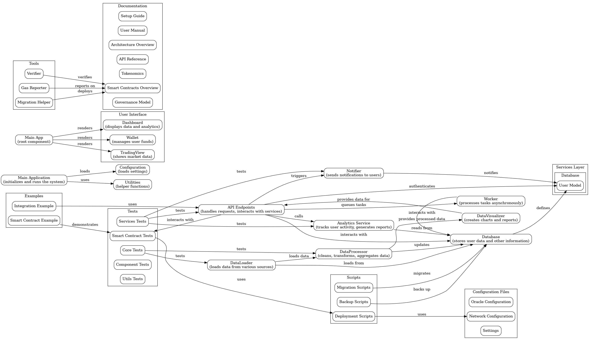

# Architecture Overview

## Introduction
The DAFE-Core is designed as a decentralized autonomous financial ecosystem that integrates various financial services using blockchain technology.

## Components
- **Smart Contracts**: Govern the logic of the ecosystem, including governance, token management, lending, staking, and insurance.
- **Frontend**: A React-based user interface that interacts with the smart contracts.
- **Oracles**: Provide real-time data feeds to the smart contracts.
- **APIs**: Facilitate external integrations and data access.

## High-Level Diagram

## Conclusion
The architecture is modular, allowing for easy upgrades and integration of new features.
